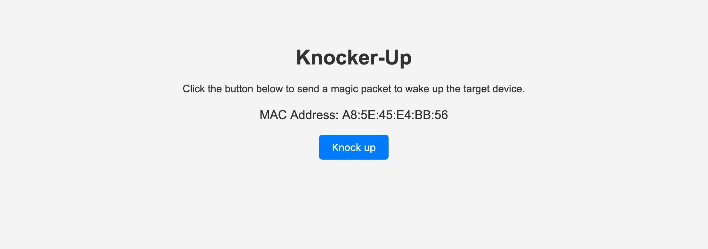

# Knocker-Up

a WakeOnLan microservice to wake up servers using a simple web ui utilizing the magic wol package



## Usage
```git clone https://github.com/Quentiiiin/knocker-up```

```cd knocker-up```

```bun i```

Set the environment variables:

    - TARGET_MAC_ADDRESS the mac address of the computer to start

Make sure the target has WoL enabled

```bun run start```
